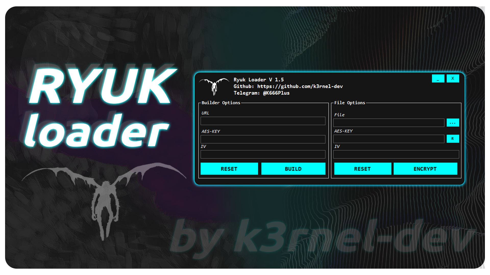
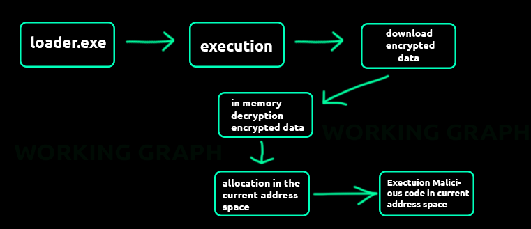

# Ryuk Loader 1.5



## 🅰️ About
```
**RyukLoader** is an experimental loader with an integrated builder. It encrypts executable files using the AES-256 algorithm, then hosts the encrypted file on a remote web server. The builder allows you to specify a link to the encrypted file. The stub loader downloads the encrypted file from the provided link, decrypts the executable bytes directly in memory, and executes them without writing them to disk.
```

## 🛡️ Working Graph


## 🛠 Features

- **AES-256 Encryption:** Securely encrypts executables, ensuring that they cannot be easily analyzed or executed without decryption.
- **In-Memory Decryption:** Decrypts and executes payloads directly in memory, bypassing disk write operations.
- **Configurable Builder:** Customize the loader's behavior by specifying different URLs and encryption keys during the build process.

## ⚙️ How It Works

1. **Encryption:** The builder takes an executable file and encrypts it using the AES-256 algorithm.
2. **Hosting:** The encrypted file is hosted on a remote web server. The builder allows you to specify the download link.
3. **Loading:** The stub loader, when executed, downloads the encrypted file from the provided URL.
4. **Decryption:** The loader decrypts the file directly in memory using the AES-256 key.
5. **Execution:** The decrypted executable is run in memory, without ever touching the disk

## 📸 Video


## 📝 Disclaimer

**Warning:** This project is for educational and research purposes only.The author is not responsible for any damages caused by using this software in malicious ways. Please use responsibly.


